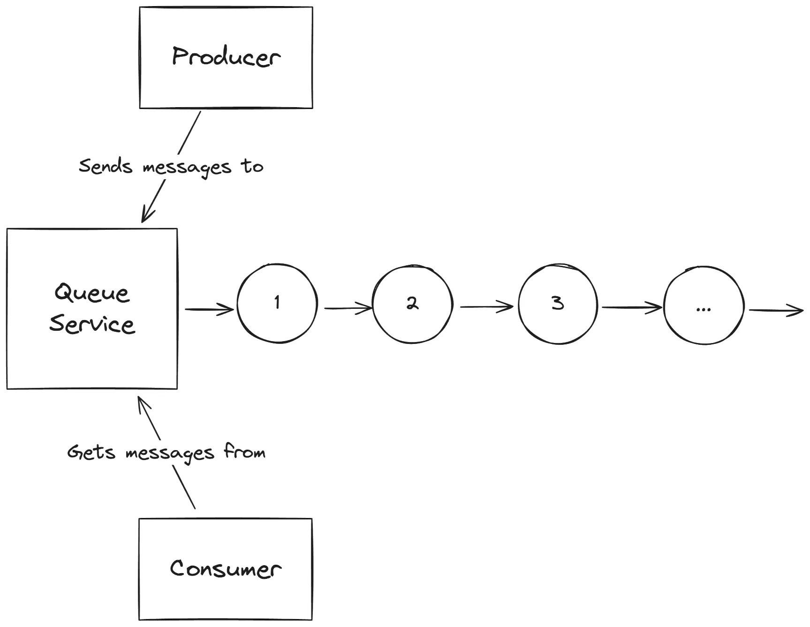
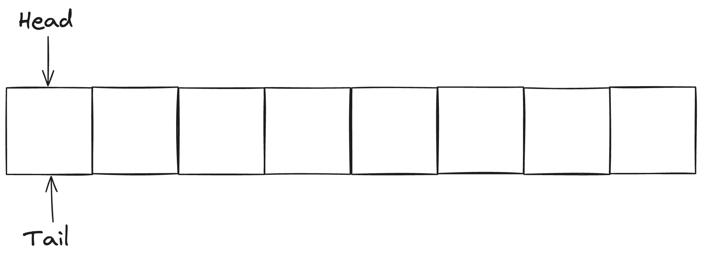
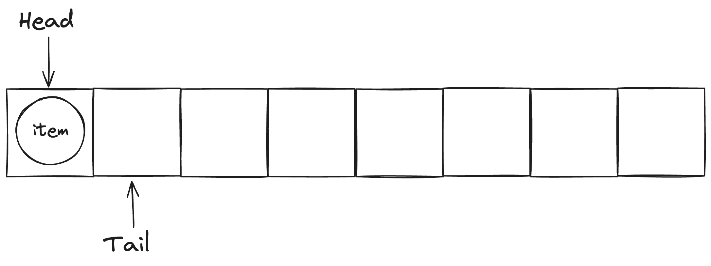
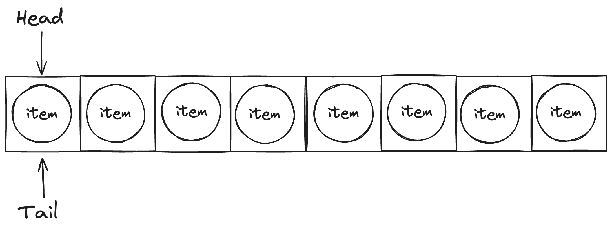
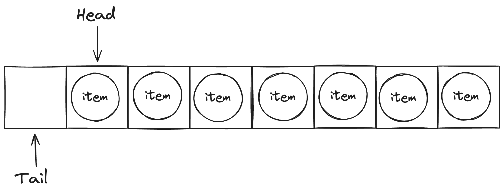
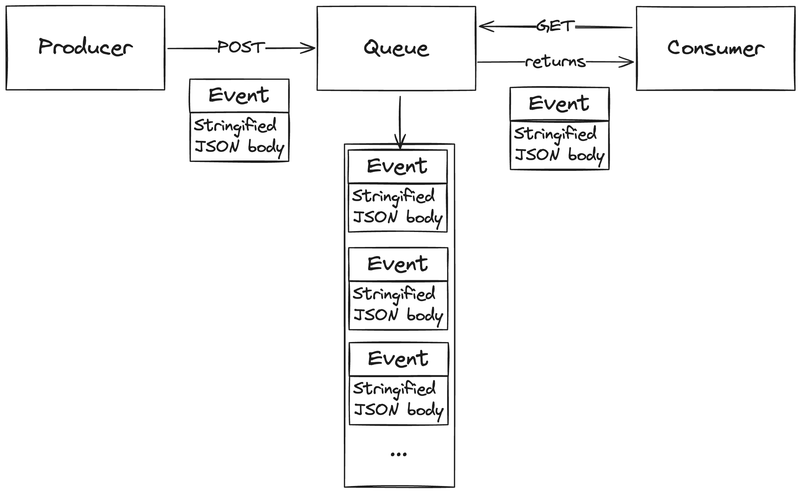

+++
title = 'Building an Event Queue Service Using Go'
date = 2024-06-15T19:26:35-07:00
draft = false
+++

> This post documents the process of developing an event queue service in Go. To see the full code, check out the [Github repository](https://github.com/malekoa/event-queue-service)

## Introduction

When working with microservices, it's important to keep your services decoupled. This makes it easier to change one component without affecting the others. But your services still need to communicate with each other. One way to do this is to have components send messages directly to each other. But this can lead to tight coupling between components, making it harder to change one component without affecting the others.

A better way to have components communicate is to use an event queue. An event queue is a service that brokers messages between components without them having to know anything about each other.

A basic event queue with a producer, queue, and consumer looks like this:


_Figure 1: Event queue service diagram._

I'll be designing and building an event queue service that can be used to send messages between components in a distributed system. Then, I'll show it in action by building a simple producer and consumer that communicate with each other using the event queue.

## Designing the Event Queue Service

### Queues

The event queue service will need to keep track of the messages it receives. I'll use (surprise!) a queue data structure to store these messages.

There are many ways to implement a queue in Go, each with benefits and drawbacks:

- **Using a slice**: A slice is a dynamic array that can grow or shrink, like an ArrayList in Java. It's easy to use and understand, but removing elements from the front of the slice runs in O(n) time.
- **Using a doubly linked list**: A doubly linked list is a linked list where the nodes have pointers to the next and previous nodes. It's more complex than a slice but it has O(1) time complexity for adding and removing elements from the front and back of the list. However, it's less cache-friendly than a slice because the nodes aren't stored contiguously in memory.
- **Using a ring buffer**: The best of both worlds, a ring buffer is a fixed-size slice that wraps around when it reaches its capacity. It has O(1) time complexity for both adding and removing elements and, because it's using a slice, is more cache-friendly than a linked list. Another benefit of using a ring buffer is that memory is allocated when the buffer is created, so there's no need to allocate memory for each new element.

Ring buffers seem like the best choice for this use case, so I'll be using one to implement the service.

### Implementing the Ring Buffer

A ring buffer looks like a normal slice, but we keep track of the head and tail end of the buffer so we know where to add and remove elements when enqueuing and dequeuing. When the tail reaches the end of the buffer, it wraps around to the beginning.

An empty ring buffer looks like this:


_Figure 2: An empty ring buffer._

When we enqueue an element, we add it to the tail end of the buffer and move the tail pointer:

_Figure 3: Enqueueing an element._

We can keep adding elements until the buffer is full (notice how the tail pointer wraps around to the beginning of the buffer):

_Figure 4: A full ring buffer._

When we dequeue an element, we remove it from the head end of the buffer and move the head pointer:

_Figure 5: Dequeueing an element._

A ring buffer should support the following operations:

- **Enqueue**: Add an element to the tail end of the buffer.
- **Dequeue**: Remove an element from the head end of the buffer.
- **Size**: Return the number of elements in the buffer.
- **Capacity**: Return the total capacity of the buffer.
- **IsEmpty**: Return true if the buffer is empty.
- **IsFull**: Return true if the buffer is full.

Here's a basic ring buffer implementation in Go:

```go
package main

import "errors"

type RingBuffer struct {
	buffer []interface{}
	size   int
	head   int
	tail   int
}

func NewRingBuffer(capacity int) *RingBuffer {
	return &RingBuffer{
		buffer: make([]interface{}, capacity),
		size:   0,
		head:   0,
		tail:   0,
	}
}

func (rb *RingBuffer) Enqueue(item interface{}) error {
	if rb.size == len(rb.buffer) {
		return errors.New("cannot enqueue to a full buffer")
	}
	rb.buffer[rb.tail] = item
	rb.tail = (rb.tail + 1) % len(rb.buffer)
	rb.size++
	return nil
}

func (rb *RingBuffer) Dequeue() (interface{}, error) {
	if rb.size == 0 {
		return nil, errors.New("cannot dequeue from an empty buffer")
	}
	item := rb.buffer[rb.head]
	rb.head = (rb.head + 1) % len(rb.buffer)
	rb.size--
	return item, nil
}

func (rb *RingBuffer) Size() int {
	return rb.size
}

func (rb *RingBuffer) Capacity() int {
	return len(rb.buffer)
}

func (rb *RingBuffer) IsEmpty() bool {
	return rb.size == 0
}

func (rb *RingBuffer) IsFull() bool {
	return rb.size == len(rb.buffer)
}
```

This implementation uses a slice to store the elements and keeps track of the head and tail pointers. The `Enqueue` and `Dequeue` methods update the pointers accordingly. The `Size`, `Capacity`, `IsEmpty`, and `IsFull` methods provide information about the buffer.

## Interacting With the Event Queue Service from a Client

Now that we have the RingBuffer implementation, we can use it to build the event queue service. There are two common ways to interact with a service like this:

1. **HTTP API**: The service exposes a set of RESTful endpoints that clients can use to interact with the service. For example, a client can send a POST request to the `/enqueue` endpoint to add a message to the queue.
2. **gRPC**: The service defines a set of protocol buffer message types and service definitions that clients can use to interact with the service. For example, a client can call the `Enqueue` method on the service to add a message to the queue.

The choice between an HTTP API and gRPC depends on the requirements of the system. HTTP APIs, in my opinion, are easier to work with and debug while, from what I understand, gRPC is more efficient and has better support for streaming and bidirectional communication.

I'll be using an HTTP API for this service, as it's simpler to set up and use. The messages will be sent as stringified JSON payloads. The service will look something like this:


_Figure 6: Event queue service with HTTP API._

### Implementing the HTTP API

To pass messages to the event queue service, clients will send HTTP requests to the service's endpoints. The messages will be sent as stringified JSON payloads.

To this end, the event queue service will expose the following endpoints:

- `POST /enqueue`: Add a message to the queue.
- `GET /dequeue`: Remove and return a message from the queue.
- `GET /size`: Return the number of messages in the queue.
- `GET /capacity`: Return the total capacity of the queue.
- `GET /isEmpty`: Return true if the queue is empty.
- `GET /isFull`: Return true if the queue is full.

I'll use the `net/http` package in Go to implement the HTTP server. Here's what the main function looks like:

```go
func main() {
	size := os.Getenv("RING_BUFFER_SIZE")
	if size == "" {
		size = "1024"
		log.Printf("RING_BUFFER_SIZE environment variable not set, defaulting to %s", size)
	}

	log.Println("Making a new ring buffer with size:", size)

	size_int, err := strconv.Atoi(size)
	if err != nil {
		log.Fatalf("failed to convert RING_BUFFER_SIZE to int: %v", err)
	}

	rb := NewRingBuffer(size_int)

	http.HandleFunc("/enqueue", enqueueHandler(rb))
	http.HandleFunc("/dequeue", dequeueHandler(rb))
	http.HandleFunc("/size", handleSize(rb))
	http.HandleFunc("/capacity", handleCapacity(rb))
	http.HandleFunc("/isEmpty", handleIsEmpty(rb))
	http.HandleFunc("/isFull", handleIsFull(rb))

	PORT := "8080"

	log.Printf("Server listening on port %s\n", PORT)
	if err := http.ListenAndServe(":"+PORT, nil); err != nil {
		fmt.Printf("Server failed to start: %v\n", err)
	}
}
```

The `main` function reads the `RING_BUFFER_SIZE` environment variable to determine the size of the ring buffer. It then creates a new ring buffer with that size and sets up the HTTP server to handle requests to the various endpoints.

The `enqueueHandler`, `dequeueHandler`, `handleSize`, `handleCapacity`, `handleIsEmpty`, and `handleIsFull` functions are the handlers for the different endpoints.

### Handling Requests

The `enqueueHandler` function handles requests to the `/enqueue` endpoint. It takes a payload that looks like this:

```json
{
  "event": "{\n  \"randomNumber\": 7423872\n}"
}
```

The `event` field contains the message to be added to the queue. The handler takes this message exactly as it is and adds it to the queue.

```go
type EnqueueRequest struct {
	Event string `json:"event"`
}
type EnqueueResponse struct {
	Message string `json:"message"`
	Event   string `json:"event"`
}

func enqueueHandler(rb *RingBuffer) http.HandlerFunc {
	return func(w http.ResponseWriter, r *http.Request) {
		if r.Method != http.MethodPost {
			http.Error(w, "Method not allowed", http.StatusMethodNotAllowed)
			log.Printf("unexpected method %s on endpoint %s", r.Method, r.URL.Path)
			return
		}
		var req EnqueueRequest
		if err := json.NewDecoder(r.Body).Decode(&req); err != nil {
			http.Error(w, err.Error(), http.StatusBadRequest)
			log.Printf("failed to decode request body: %v", err)
			return
		}

		if err := rb.Enqueue(req.Event); err != nil {
			http.Error(w, err.Error(), http.StatusInternalServerError)
			log.Printf("failed to enqueue item: %v", err)
			return
		}

		response := EnqueueResponse{
			Message: "Successfully enqueued event",
			Event:   req.Event,
		}

		w.Header().Set("Content-Type", "application/json")

		if err := json.NewEncoder(w).Encode(response); err != nil {
			w.WriteHeader(http.StatusInternalServerError)
			log.Printf("failed to encode response: %v", err)
			return
		}
	}
}
```

Next, the `dequeueHandler` function handles requests to the `/dequeue` endpoint. It removes and returns the message at the head of the queue.

```go
type DequeueResponse struct {
	Message string `json:"message"`
	Event   string `json:"event"`
}

func dequeueHandler(rb *RingBuffer) http.HandlerFunc {
	return func(w http.ResponseWriter, r *http.Request) {
		if r.Method != http.MethodGet {
			http.Error(w, "Method not allowed", http.StatusMethodNotAllowed)
			log.Printf("unexpected method %s on endpoint %s", r.Method, r.URL.Path)
			return
		}

		item, err := rb.Dequeue()
		if err != nil {
			http.Error(w, err.Error(), http.StatusInternalServerError)
			log.Printf("failed to dequeue item: %v", err)
			return
		}

		response := DequeueResponse{
			Message: "Successfully dequeued event",
			Event:   item.(string),
		}

		w.Header().Set("Content-Type", "application/json")
		if err := json.NewEncoder(w).Encode(response); err != nil {
			w.WriteHeader(http.StatusInternalServerError)
			log.Printf("failed to encode response: %v", err)
			return
		}
	}
}
```

The `handleSize`, `handleCapacity`, `handleIsEmpty`, and `handleIsFull` functions handle requests to the `/size`, `/capacity`, `/is_empty`, and `/is_full` endpoints, respectively. These are pretty self-explanatory:

```go
type SizeResponse struct {
	Size int `json:"size"`
}

func handleSize(rb *RingBuffer) http.HandlerFunc {
	return func(w http.ResponseWriter, r *http.Request) {
		if r.Method != http.MethodGet {
			http.Error(w, "Method not allowed", http.StatusMethodNotAllowed)
			log.Printf("unexpected method %s on endpoint %s", r.Method, r.URL.Path)
			return
		}
		response := SizeResponse{
			Size: rb.Size(),
		}
		if err := json.NewEncoder(w).Encode(response); err != nil {
			w.WriteHeader(http.StatusInternalServerError)
			log.Printf("failed to encode response: %v", err)
			return
		}
	}
}

type CapacityResponse struct {
	Capacity int `json:"capacity"`
}

func handleCapacity(rb *RingBuffer) http.HandlerFunc {
	return func(w http.ResponseWriter, r *http.Request) {
		if r.Method != http.MethodGet {
			http.Error(w, "Method not allowed", http.StatusMethodNotAllowed)
			log.Printf("unexpected method %s on endpoint %s", r.Method, r.URL.Path)
			return
		}
		response := CapacityResponse{
			Capacity: rb.Capacity(),
		}
		if err := json.NewEncoder(w).Encode(response); err != nil {
			w.WriteHeader(http.StatusInternalServerError)
			log.Printf("failed to encode response: %v", err)
			return
		}
	}
}

type IsEmptyResponse struct {
	IsEmpty bool `json:"isEmpty"`
}

func handleIsEmpty(rb *RingBuffer) http.HandlerFunc {
	return func(w http.ResponseWriter, r *http.Request) {
		if r.Method != http.MethodGet {
			http.Error(w, "Method not allowed", http.StatusMethodNotAllowed)
			log.Printf("unexpected method %s on endpoint %s", r.Method, r.URL.Path)
			return
		}
		response := IsEmptyResponse{
			IsEmpty: rb.IsEmpty(),
		}
		if err := json.NewEncoder(w).Encode(response); err != nil {
			w.WriteHeader(http.StatusInternalServerError)
			log.Printf("failed to encode response: %v", err)
			return
		}
	}
}

type IsFullResponse struct {
	IsFull bool `json:"isFull"`
}

func handleIsFull(rb *RingBuffer) http.HandlerFunc {
	return func(w http.ResponseWriter, r *http.Request) {
		if r.Method != http.MethodGet {
			http.Error(w, "Method not allowed", http.StatusMethodNotAllowed)
			log.Printf("unexpected method %s on endpoint %s", r.Method, r.URL.Path)
			return
		}
		response := IsFullResponse{
			IsFull: rb.IsFull(),
		}
		if err := json.NewEncoder(w).Encode(response); err != nil {
			w.WriteHeader(http.StatusInternalServerError)
			log.Printf("failed to encode response: %v", err)
			return
		}
	}
}
```

## Dockerizing the Event Queue Service

To make it easier to deploy the event queue service, I'll create a Docker image for it. The Dockerfile will look like this:

```Dockerfile
FROM golang:1.22

WORKDIR /app

RUN apt-get update && apt-get install -y git

RUN git clone https://github.com/malekoa/event-queue-service .

RUN go mod download -x

RUN go build -o main .

CMD ["./main"]
```

This Dockerfile uses the official Golang image as the base image. It installs Git, clones the repository, downloads the dependencies, builds the binary, and runs the binary when the container starts.

To build and run the Docker image, use the following commands:

```bash
docker build -t event-queue-service .
docker run -p 8080:8080 event-queue-service
```

## Building the Producer and Consumer Services

Now that we have the event queue service set up, we can build the two services that we want to communicate with each other using the event queue.

To keep things simple, both the producer and consumer services will just be infinite loops that send and receive messages from the event queue service. The producer will send a message every second, and the consumer will poll for messages every 500 milliseconds.

### Producer Service

The producer service needs to send messages that look like this, where the value of `event` is a stringified JSON payload:

```json
{
  "event": "{\n  \"randomNumber\": 7423872\n}"
}
```

Here's the code for the producer service, written in python using the `requests` library:

```python
import json
import time
import datetime
import random
import requests


def generate_event():
    """
    Generate a random event.
    """
    event_name = "EVENT_" + str(random.randint(0, 100))
    event_value = random.randint(0, 100)
    event_data = {
        "event_name": event_name,
        "event_value": event_value,
        "event_time": str(datetime.datetime.now().isoformat()),
    }
    return {
        "event": json.dumps(event_data),
    }


if __name__ == "__main__":
    EVENT_QUEUE_URL = "http://localhost:8080/enqueue"
    while True:
        try:
            event = generate_event()
            response = requests.post(EVENT_QUEUE_URL, json=event, timeout=1)
            print(response.text)
        except Exception as e:
            print(f"Error: {e}")
        time.sleep(1)
```

### Consumer Service

The consumer service needs to poll the event queue service for messages and process them. Also, if the queue is empty, then the consumer should handle that case gracefully.

Here's the code for the consumer service:

```python
import json
import time
import requests

if __name__ == "__main__":
    EVENT_QUEUE_URL = "http://localhost:8080/"

    while True:
        is_empty = json.loads(requests.get(EVENT_QUEUE_URL + "isEmpty", timeout=1).text)
        if not is_empty.get("isEmpty"):
            try:
                event = json.loads(
                    requests.get(EVENT_QUEUE_URL + "dequeue", timeout=1).text
                )
                print(f"Consumed event: {event}")
            except Exception as e:
                print(f"Error: {e}")
        else:
            print("Queue is empty.")
        time.sleep(0.5)
```

## Running the Services

If you've followed along so far, you should have the event queue service running in a Docker container. You can now run the producer and consumer services in separate terminals to see them communicate with each other through the event queue. The producer will send a message every second, and the consumer will poll for messages every 500 milliseconds. The output should look something like this:

```bash
# Terminal 1
$ python producer.py
{"message":"Successfully enqueued event","event":"{\"event_name\": \"EVENT_42\", \"event_value\": 42, \"event_time\": \"2024-06-15T19:26:35.000000\"}"}
{"message":"Successfully enqueued event","event":"{\"event_name\": \"EVENT_12\", \"event_value\": 12, \"event_time\": \"2024-06-15T19:26:36.000000\"}"}
{"message":"Successfully enqueued event","event":"{\"event_name\": \"EVENT_99\", \"event_value\": 99, \"event_time\": \"2024-06-15T19:26:37.000000\"}"}
{"message":"Successfully enqueued event","event":"{\"event_name\": \"EVENT_23\", \"event_value\": 23, \"event_time\": \"2024-06-15T19:26:38.000000\"}"}
{"message":"Successfully enqueued event","event":"{\"event_name\": \"EVENT_77\", \"event_value\": 77, \"event_time\": \"2024-06-15T19:26:39.000000\"}"}
...
```

```bash
# Terminal 2
$ python consumer.py
Consumed event: {'event_name': 'EVENT_42', 'event_value': 42, 'event_time': '2024-06-15T19:26:35.000000'}
Queue is empty.
Consumed event: {'event_name': 'EVENT_12', 'event_value': 12, 'event_time': '2024-06-15T19:26:36.000000'}
Queue is empty.
Consumed event: {'event_name': 'EVENT_99', 'event_value': 99, 'event_time': '2024-06-15T19:26:37.000000'}
Queue is empty.
Consumed event: {'event_name': 'EVENT_23', 'event_value': 23, 'event_time': '2024-06-15T19:26:38.000000'}
Queue is empty.
Consumed event: {'event_name': 'EVENT_77', 'event_value': 77, 'event_time': '2024-06-15T19:26:39.000000'}
Queue is empty.
...
```

## Conclusion

While this is a very simple example, it demonstrates the power of using an event queue to decouple components in a distributed system. There are many ways to extend this example from adding multiple queues to implementing retries. Another huge improvement that wouldn't be too difficult to implement would be dynamically resizing the ring buffer when it reaches its capacity. I'll probably get around to that at some point.
